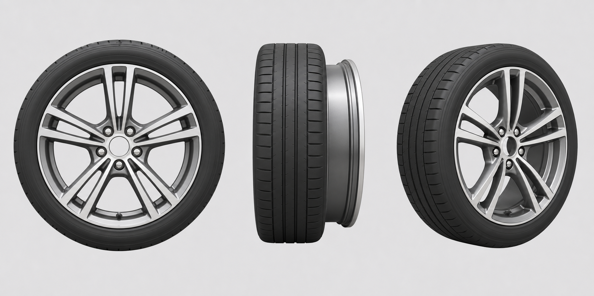

# Experimento de autoria — roda realista

Este documento fixa o contrato do experimento que verifica até onde uma IA
consegue levar uma roda usando **somente** a linguagem procedural da Oficina e a
bancada da Mecanifica. O objetivo não é substituir às pressas a roda atual: é
medir o fluxo, o resultado e as capacidades que faltam.

## Restrições do experimento

- não usar Blender, glTF, arquivo de malha externo ou geometria pronta;
- não alterar `roda-dianteira.js`, o núcleo da Oficina ou a apresentação;
- criar uma variante isolada chamada `roda-dianteira-realista-experimento`;
- usar apenas `PASSOS`, `PARAMS`, `TOPO`, `MATERIAIS` e `ALIASES` já aceitos;
- não persistir ids de face, vértice, índice de array ou UUID do Three.js;
- dar identidade semântica a toda face;
- registrar cada limitação ou contorno encontrado, inclusive quando impedir o
  alvo visual.

## Alvo visual e verdade técnica

A imagem é referência de **aparência**: pneu com ombros e sulcos, aro vazado,
dez braços formando cinco raios duplos, barril, flange, rebaixo central e cinco
fixadores. Ela não é desenho técnico e não fornece medidas ocultas.

A verdade dimensional continua sendo
[`PRANCHA-RODA-DIANTEIRA.md`](PRANCHA-RODA-DIANTEIRA.md): eixo X, raio externo
0,340 m, largura 0,220 m e composição com o cubo já existente no freio. Não criar
outro cubo para obter a aparência da imagem.

## Perfil solicitado

`realista-apresentacao`, com estas prioridades em ordem:

1. silhueta e proporções plausíveis em direita, frontal e isométrica;
2. construção legível — pneu, barril/aro, raios, miolo e fixadores;
3. aberturas reais entre raios, capazes de revelar o freio;
4. chanfros ou transições que capturem luz sem parecer blocos crus;
5. materiais distintos para borracha, metal e recessos;
6. sulcos principais no pneu, sem exigir microtextura fotográfica;
7. partes selecionáveis e isoláveis na bancada.

O agente pode reduzir detalhe se a linguagem impedir uma forma, mas deve
registrar o ponto exato da redução. Não deve esconder a limitação com um disco
opaco ou chamar uma superfície pintada de abertura.

## Entregáveis do subagente

- `prototipos/fps/v3/pecas/roda-dianteira-realista-experimento.js`;
- `docs/mecanifica/RELATO-RODA-REALISTA.md`, com tentativas, contornos e
  capacidades ausentes;
- prova `npm run descrever -- roda-dianteira-realista-experimento`;
- vistas direita, frontal e isométrica na bancada;
- nenhuma integração com `index.html` ou registros de domínio.

## Avaliação posterior

O agente principal atribuirá notas independentes de 0 a 10 para:

- aparência e leitura de fabricação;
- plausibilidade mecânica e encaixe;
- identidade/separabilidade;
- facilidade de refinamento por outro agente;
- custo geométrico e de autoria.

Uma aparência melhor não compensa chuva de ids ou uma peça impossível de
refinar. Da mesma forma, testes verdes não bastam se o resultado continuar com
aparência de disco sólido.

## Estado final

**CONCLUÍDO, SEM INTEGRAÇÃO.** A variante isolada chegou a uma roda técnica
estilizada, substancialmente melhor que o marcador simples, mas não atingiu o
perfil `realista-apresentacao`. Ela permanece como prova e não substitui
`roda-dianteira.js`.

O resultado, as tentativas e as limitações estão em
[`RELATO-RODA-REALISTA.md`](RELATO-RODA-REALISTA.md). A avaliação comparável e o
fluxo que ela passou a justificar estão em
[`PERFIS-DE-AUTORIA.md`](PERFIS-DE-AUTORIA.md).
